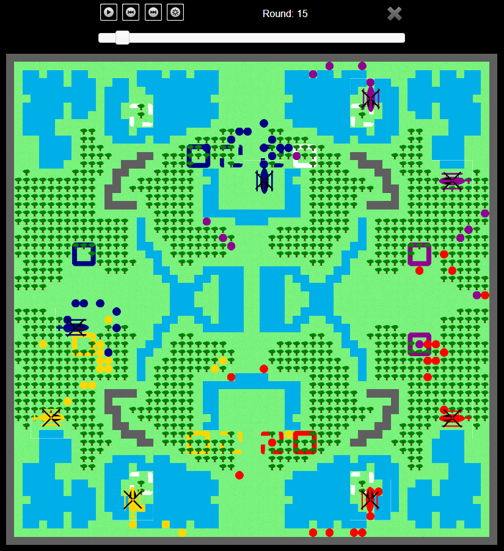

# ApocalypseNow

Original authors: Omer Giménez, Jordi Petit, Enric Rodríguez, Salvador Roura
(c) Universitat Politècnica de Catalunya, 2014

## Building

To build the game you need to have installed a C++ compiler (gcc, clang or MSVC) and CMake:

```shell
cmake --preset default
cmake --build release
```

The game will be located in build/default/Release/

## Running

To run the game you just need to pass the path to the map and 4 names of players. Assuming that you are in the build/default/Release/ folder:

```shell
./apocalypse -i ../../../maps/default.cnf jormaig dummy dummy dummy > result.txt
```

You can use the `-l` flag to list the available players.


## Visualizing the game

The `result.txt` file will contain all the simulation of the game. To visualize it, you can open the `viewer/viewer.html` file on a browser and load the `result.txt` file. This will show you the outcome of the game. It should look like this:



## Adding a player.

To add a player, copy the `aidemo.cpp` from `src/players` and rename it with your own name (e.g. `aimyplayer.cpp`). Then set the value of the macro `PLAYER_NAME` to a name of a player that hasn't been defined yet and start writing your player code. 
